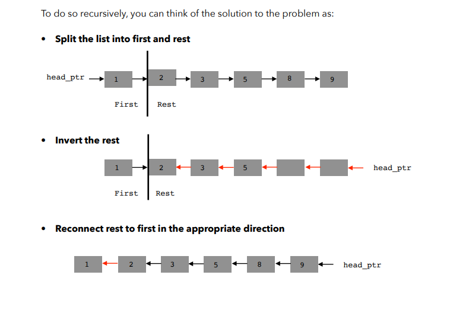
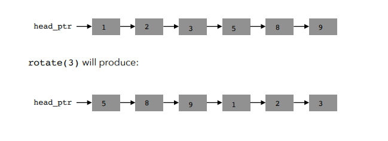

## Project 5: &nbsp;Recursion, Inversion, and Rotation: The single life of a Singly-Linked List

Your objective for this project is to update a Singly-Linked list class to support inversion and rotation functionality. In order to successfully complete this project, you **must** understand the prerequisite material from all previous projects, and you **must** understand the concept of a Linked List ADT.


#### Some additional resources

* Linked List:

    [Geeks for Geeks](https://www.geeksforgeeks.org/linked-list-set-1-introduction/)  

    [CMU](https://www.cs.cmu.edu/~adamchik/15-121/lectures/Linked%20Lists/linked%20lists.html)

    [edspresso](https://www.educative.io/edpresso/what-is-a-linked-list)

#### Implementation

**Work incrementally!** Work through the tasks sequentially (implement and test). Only move on to a task when you are positive that the previous one has been completed correctly. Remember that the names of function prototypes and member variables must exactly match those declared in the respective header file when implementing a class.

---

<h3 style="text-align: center; color: #FFBBBB;">Task 1: All roads lead to Rome and back home</h3> 

"A singly-linked list can be inverted" was once a song of dreams, a tale from a time before the invention of the doubly-linked list. Then, the budding programmer could iterate from head to tail, but they could not iterate from tail to head - that is, until one thought of a way to take a singly-linked list and invert it in order to make all of the links point in the opposite direction. Your task, should you choose to accept it, is to implement this inversion within the provided `LinkedList` files. Your implementation must be in O(n) time using O(1) extra space. This can be acheived by splitting your list into two parts, the first and the rest. Here is an example:



Write a public and non-recursive function `invert()` that calls a private and recursive `invertRest()`. `invertRest()` must be implemented recursively and you may **not** create additional lists, containers, or copies of nodes to aid you in your venture.

```
/** 
    A wrapper to a recursive method that inverts the contents of the list

    @post the contents of the list are inverted such that:
        the item previously at position 1 is at position item_count_,
        the item previously at position 2 is at position item_count_-1 ...
        the item previously at position ⌊item_count/2⌋ is at position 
            ⌈item_count_/2⌉
*/
void invert();


/**
    private function to invert, used for safe programming to avoid 
    exposing pointers to list in public methods

    @post the contents of the list are inverted such that:
        the item previously at position 1 is at position item_count_,
        the item previously at position 2 is at position item_count_-1 ...
        the item previously at position ⌊item_count/2⌋ is at position
            ⌈item_count_/2⌉
*/
void invertRest(Node<T>* current_first_ptr); 
```

---

<h3 style="text-align: center; color: #FFBBBB;">Task 2: An end is just a new beginning</h3>

Your task, should you choose to accept it, is to implement a rotate function that, given any k, will shift all items in the caller `LinkedList` k positions to the right. Items that move beyond the final position **must** wrap around to the beginning. Here is an example:



`rotate()` is a public and recursive function that should be implemented with O(1) extra space, which means no additional lists, containers, or nodes are needed to implement it. This can be acheived by _relinking_ the nodes currently in the list.

```
/**
    @pre k >= 0
    @post the contents of the list are rotated to the right by k places, 
        so that every element at position i shifts to position i+k % item_count_
*/
void rotate(int k);

```

**Hint: Think of the problem as "perform the smallest rotation (i.e. k = 1) by moving the last node to be the first and then rotate the rest recursively (k-1)."**

---

### Testing

How to compile:

```
g++ <main file> -std=c++17
```

You must always implement and test you programs **INCREMENTALLY!!!**
What does this mean? Implement and test one method at a time.
**For each class**
* Implement one function/method and test it thoroughly (multiple test cases + edge cases if applicable).
* Implement the next function/method and test in the same fashion.
    **How do you do this?** Write your own `main()` function to test your classes. In this course you will never submit your test program, but you must always write one to test your classes. Choose the order in which you implement your methods so that you can test incrementally: i.e. implement mutator functions before accessor functions. Sometimes functions depend on one another. If you need to use a function you have not yet implemented, you can use stubs: a dummy implementation that always returns a single value for testing Don’t forget to go back and implement the stub!!! If you put the word STUB in a comment, some editors will make it more visible.

#### Grading Rubric
**Correctness 80%** (distributed across unit testing of your submission)
**Documentation 10%**
**Style and Design 10%** (proper naming, modularity, and organization)

**Important:** You must start working on the projects as soon as they are assigned to detect any problems with submitting your code and to address them with us **well before** the deadline so that we have time to get back to you **before** the deadline. This means that you must submit and resubmit your project code **early** and **often** in order to resolve any issues that might come up **before** the project deadline.
##### There will be no negotiation about project grades after the submission deadline. #####
  
#### Submission:
You will submit **the following files**:
`LinkedList.cpp`
`LinkedList.hpp`

Your project must be submitted on Gradescope. Although Gradescope allows multiple submissions, it is not a platform for testing and/or debugging and it should not be used for that. You MUST test and debug your program locally. Before submitting to Gradescope you MUST ensure that your program compiles (with g++) and runs correctly on the Linux machines in the labs at Hunter (see detailed instructions on how to upload, compile and run your files in the “Programming Rules” document). That is your baseline, if it runs correctly there it will run correctly on Gradescope, and if it does not, you will have the necessary feedback (compiler error messages, debugger or program output) to guide you in debugging, which you don’t have through Gradescope. “But it ran on my machine!” is not a valid argument for a submission that does not compile. Once you have done all the above you submit it to Gradescope.
